<h1 align="center">Alejandro Pérez</h1>

  Telecommunication Technologies Engineering graduate (UMH) · Embedded systems & full-stack development

<table>
  <tr>
    <td valign="top"></td>
    <td valign="top"></td>
  </tr>
</table>

---

## Projects

<a href="https://github.com/Przz23/kira">View kira on GitHub →</a> · <a href="https://github.com/Przz23/second-brain">Download Second Brain →</a>

